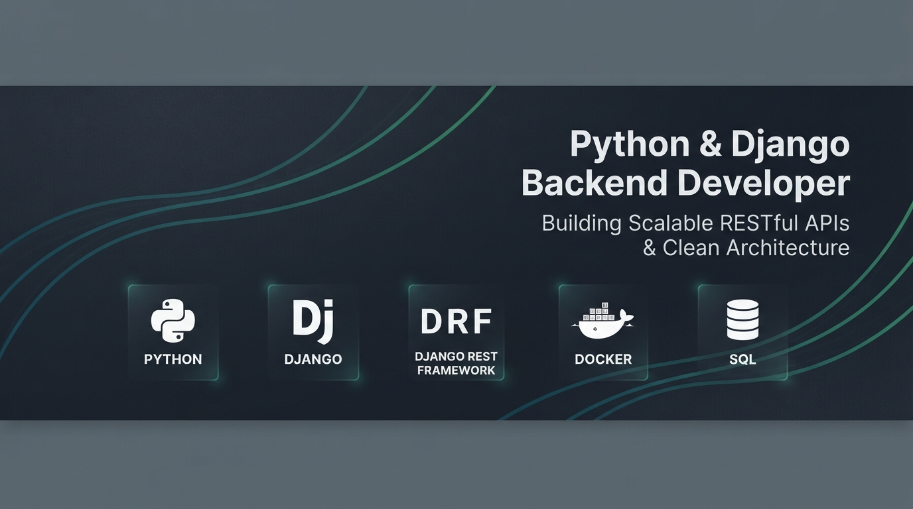

# Hi, I'm Arghavan Monajemi 👋

**Backend Software Engineer | Python, Django & DRF Specialist**

I am a Computer Engineering graduate specializing in designing, building, and deploying scalable, production-ready backend architectures and RESTful APIs using Python and Django. 

I focus on writing clean, maintainable code following sound architecture principles, automated testing, containerized deployments, and asynchronous task management.

---

### 🛠️ Technical Stack & Core Competencies

- **Languages & Core:** Python, C, SQL
- **Backend & APIs:** Django, Django REST Framework (DRF), JWT Authentication, CORS Security
- **Database & Querying:** PostgreSQL, SQLite, Django ORM, Database Query Optimization
- **Asynchronous Architecture:** Redis (Caching & Message Broker), Celery, Celery Beat
- **DevOps & Infrastructure:** Docker, Docker Compose, Nginx (Reverse Proxy), Gunicorn, GitHub Actions (CI/CD)
- **Testing & Code Quality:** `pytest`, `unittest`, `flake8`, `black`, `Faker`, Locust (Load Testing)

---

### 🚀 Featured Project

#### 🌟 [Advanced Django REST Framework Backend Platform](https://github.com/ArghavanMonajemi/django-advanced-blog)
A production-ready, containerized backend API featuring JWT authentication, automated testing pipelines (`pytest`), async task queues (Celery + Redis), Redis caching, load testing, and multi-stage Docker orchestration for Nginx and Gunicorn.

---

### 🎓 Education & Academic Experience

- **B.S. in Computer Engineering**
University of Kurdistan | 2017 – 2021

- **International Exchange Semester – Computer Engineering**  
Universidad de Jaén, Spain | 2021  
Completed coursework in Advanced Computer Science & Software Engineering in an international academic environment.
- **Professional English Proficiency:** IELTS Overall Band 7.5

---

### 📫 Connect With Me

- **LinkedIn:** [linkedin.com/in/arghavanmonajemi](https://linkedin.com/in/arghavanmonajemi/)
- **Email:** *monajemi.am@gmail.com*
